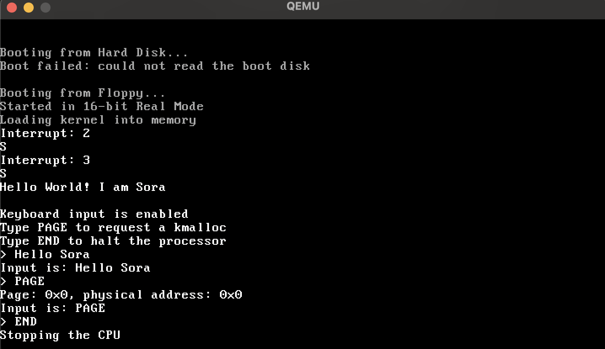

# Sora: A mini operating system

Sora is a small operating system with a small bootloader and a small kernel.

This project was started in January 2024. At the time, I had finished an operating system class a few semesters ago but it was a lot of theory. After that class, I didn't feel like I truely understand operating system and how they work. So I decided to try to make my own operating system to get more practical experience and a deeper understanding of OS development. That's why I started this project.

This is a big learning project for me so the code is somewhat messy. I've documented everything quite throughly through so if you want to, you can go through the code and learn more about operating system development.

# Requirements

Before you can compile this, you need to install some tools and libraries first:

- [NASM](https://www.nasm.org/)
- [QEMU](https://www.qemu.org/)
- [i386-elf-toolchain](https://github.com/nativeos/i386-elf-toolchain/releases)
- [binutils](https://www.gnu.org/software/binutils/)
- [gmp](https://gmplib.org/)
- [mpfr](https://www.mpfr.org/)

# Project structure

- The [bootsector](bootsector) directory is some mini bootsector projects that I made to get used to programming the bootsector.
- The [kernel](kernel) directory is where you'll find the source code for Sora. Compile and run the kernel there.

# Useful commands

| Commands | Description |
| --- | --- |
| `make` | Compile |
| `make run` | Compile and run|
| `make debug` | Run and debug in GDB |
| `make clean` | Remove object and binary files |

# Milestones

- [x] Simple bootloader in 16-bit real mode
- [x] Accessing the disk
- [x] Program the GDT
- [x] Switch to 32-bit protected mode
- [x] Simple kernel
- [x] Video driver
- [x] Interrupt Descriptor Table
- [x] Parse user input
- [x] Memory allocator

# Documentation

You can find all the documentations in this [directory](kernel/docs/). I've also added detailed explanation comments for most of the code so you can understand the code by reading it.

# References

- [OSDev Wiki](https://wiki.osdev.org/Main_Page)
- [University of Birmingham's os-dev.pdf](https://www.cs.bham.ac.uk/~exr/lectures/opsys/10_11/lectures/os-dev.pdf)
- [JamesM's kernel development tutorials](https://web.archive.org/web/20221202213259/http://www.jamesmolloy.co.uk/tutorial_html/1.-Environment%20setup.html)
- [Intel 64 and IA-32 Architectures Software Developer’s Manual](https://www.intel.com/content/www/us/en/developer/articles/technical/intel-sdm.html)
