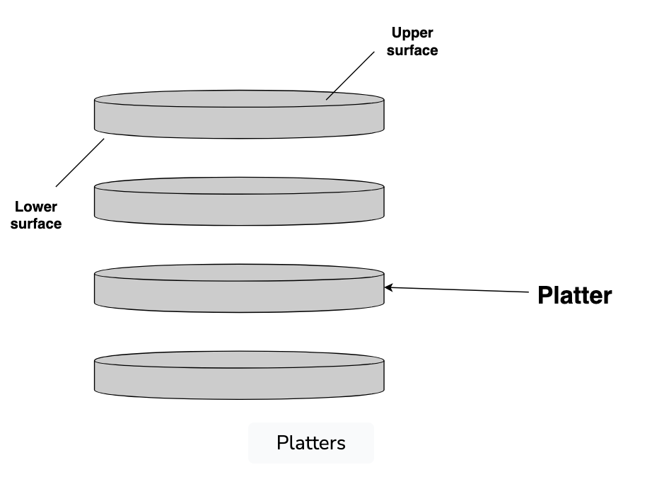
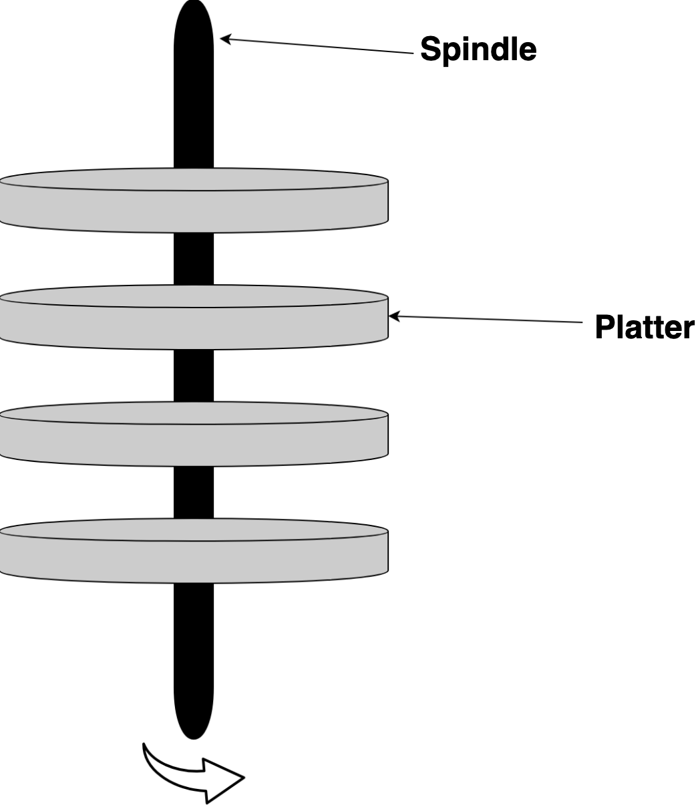
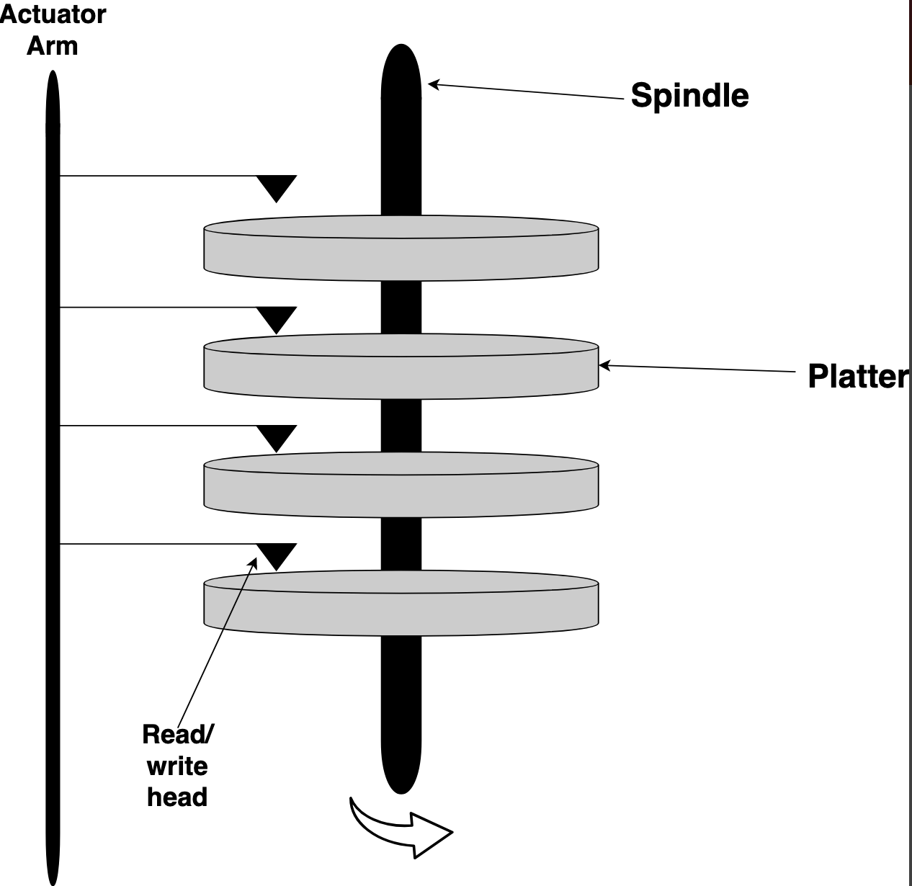
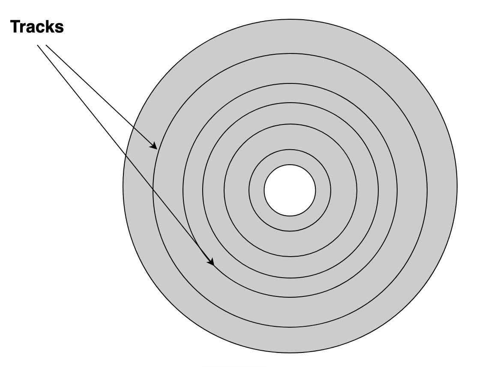
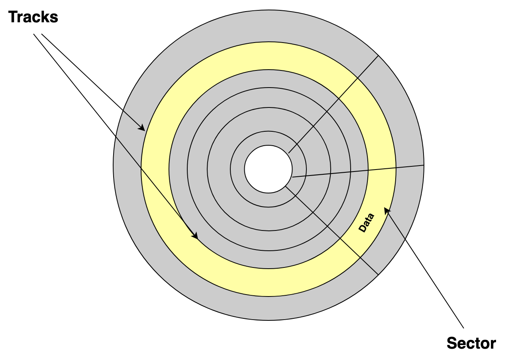

# Components

- Platters
- Spindle
- Read/write heads
- Tracks 
- Sectors

# Platters

- Hard disk is organized to a concentric stack of disks
- A platter is an individual disk
- Each platter has a lower and an upper surface

# Spindle

- Platters are connected together by a spindle that runs through the middle
- Spindle moves in a unidirectional manner along its axis (clockwise or counterclockwise)
- Cause platters to rotate

# Read/write heads

- Used to read and write data to each platter surface
- Can move back and forth along the surface of a platter
- Connected to an actuator arm

# Tracks

- Circular areas on the surface of a platter that move towards the center of platter
- Each surface platter has a fixed number of tracks
- Data is written to the outermost track

# Sectors

- Each track is divided to a fixed number of sectors
- Sectors divide each track sections and store data

